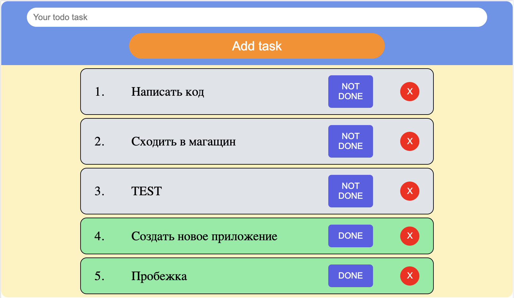

### ToDo project
The project implements a task management application (ToDo List) using React and Redux. The application allows users to add new tasks, mark tasks as completed, delete tasks, and edit task text.

All tasks are stored in the Redux store and also in the browser's local storage to ensure data persistence even when the page is refreshed. The use of Redux facilitates state management and updates the application interface based on user actions.

The project is based on using React, Redux, and CSS styles to create the user interface. It follows a modular component structure for convenient separation of functionality and code reusability.

Please note that the original text you provided is already in English.

